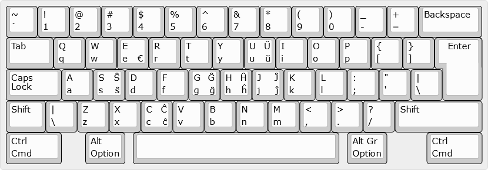

# English (US), Esperanto
- Bottom left (corner) - by default
- Top left - <kbd>Shift</kbd>
- Bottom right - <kbd>Alt Gr</kbd> (or <kbd>Ctrl</kbd> + <kbd>Alt</kbd>)
- Top right - <kbd>Shift</kbd> + <kbd>Alt Gr</kbd>



<details>
  <summary>Source</summary>

  ```
  http://www.keyboard-layout-editor.com/##@_name=English (US), Esperanto&css=* { %0A%20%20%20 font-family%2F: 'Verdana'%2F%3B%0A%20%20%20 font-size%2F: 15px%2F%3B%0A}%3B&@=~%0A`&=!%0A1&=%2F@%0A2&=%23%0A3&=$%0A4&=%25%0A5&=^%0A6&=%2F&%0A7&=*%0A8&=(%0A9&=)%0A0&=%2F_%0A-&=+%0A%2F=&_w:2%3B&=Backspace%3B&@_w:1.5%3B&=Tab&=Q%0Aq&=W%0Aw&=E%0Ae%0A%0A€&=R%0Ar&=T%0At&=Y%0Ay&=U%0Au%0AŬ%0Aŭ&=I%0Ai&=O%0Ao&=P%0Ap&={%0A[&=}%0A]&_x:0.25&w:1.25&h:2&w2:1.5&h2:1&x2:-0.25%3B&=Enter%3B&@_w:1.75%3B&=Caps Lock&=A%0Aa&=S%0As%0AŜ%0Aŝ&=D%0Ad&=F%0Af&=G%0Ag%0AĜ%0Aĝ&=H%0Ah%0AĤ%0Aĥ&=J%0Aj%0AĴ%0Aĵ&=K%0Ak&=L%0Al&=%2F:%0A%2F%3B&="%0A'&=|%0A\%3B&@_w:1.25%3B&=Shift&=|%0A\&=Z%0Az&=X%0Ax&=C%0Ac%0AĈ%0Aĉ&=V%0Av&=B%0Ab&=N%0An&=M%0Am&=<%0A,&=>%0A.&=%3F%0A%2F%2F&_w:2.75%3B&=Shift%3B&@_w:1.75%3B&=Ctrl%0ACmd&_x:0.75&w:1.25%3B&=Alt%0AOption&_x:0.25&a:7&w:6.5%3B&=&_x:0.25&a:4&w:1.25%3B&=Alt Gr%0AOption&_x:1.25&w:1.75%3B&=Ctrl%0ACmd
  ```
</details>