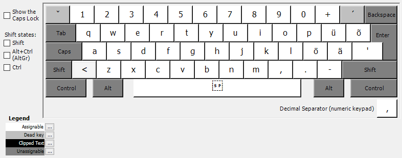
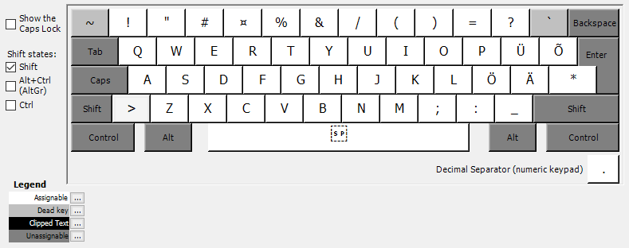
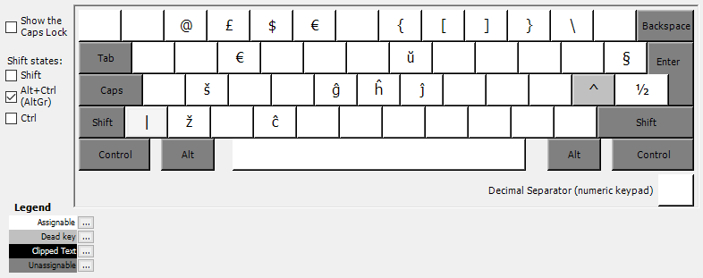
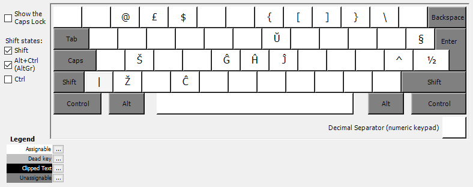

# Algselt

## <kbd>ˇ</kbd>
- <kbd>ˇ</kbd> = <kbd>ˇ</kbd>, (seejärel) <kbd>tühik</kbd>
- <kbd>č</kbd> = <kbd>ˇ</kbd>, <kbd>c</kbd>
- <kbd>š</kbd> = <kbd>ˇ</kbd>, <kbd>s</kbd>
- <kbd>ž</kbd> = <kbd>ˇ</kbd>, <kbd>z</kbd>

## <kbd>´</kbd>
- <kbd>´</kbd> = <kbd>´</kbd>, (seejärel) <kbd>tühik</kbd>
- <kbd>ć</kbd> = <kbd>´</kbd>, <kbd>c</kbd>
- <kbd>é</kbd> = <kbd>´</kbd>, <kbd>e</kbd>
- <kbd>ń</kbd> = <kbd>´</kbd>, <kbd>n</kbd>
- <kbd>ó</kbd> = <kbd>´</kbd>, <kbd>o</kbd>
- <kbd>ś</kbd> = <kbd>´</kbd>, <kbd>s</kbd>
- <kbd>ź</kbd> = <kbd>´</kbd>, <kbd>z</kbd>

# Shift

## <kbd>~</kbd>
- <kbd>~</kbd> = <kbd>~</kbd>, (seejärel) <kbd>tühik</kbd>
- <kbd>õ</kbd> = <kbd>~</kbd>, <kbd>o</kbd>

## <kbd>`</kbd>
- <kbd>\`</kbd> = <kbd>\`</kbd>, (seejärel) <kbd>tühik</kbd>
- <kbd>à</kbd> = <kbd>\`</kbd>, <kbd>a</kbd>
- <kbd>è</kbd> = <kbd>\`</kbd>, <kbd>e</kbd>
- <kbd>ò</kbd> = <kbd>\`</kbd>, <kbd>o</kbd>
- <kbd>ù</kbd> = <kbd>\`</kbd>, <kbd>u</kbd>

# AltGr / Alt+Ctrl

## <kbd>^</kbd>
- <kbd>^</kbd> = <kbd>^</kbd>, (seejärel) <kbd>tühik</kbd>
- <kbd>â</kbd> = <kbd>^</kbd>, <kbd>a</kbd>
- <kbd>ê</kbd> = <kbd>^</kbd>, <kbd>e</kbd>
- <kbd>ĝ</kbd> = <kbd>^</kbd>, <kbd>g</kbd>
- <kbd>î</kbd> = <kbd>^</kbd>, <kbd>i</kbd>
- <kbd>ŝ</kbd> = <kbd>^</kbd>, <kbd>s</kbd>
- <kbd>û</kbd> = <kbd>^</kbd>, <kbd>u</kbd>

# Shift+AltGr / Shift+Alt+Ctrl
