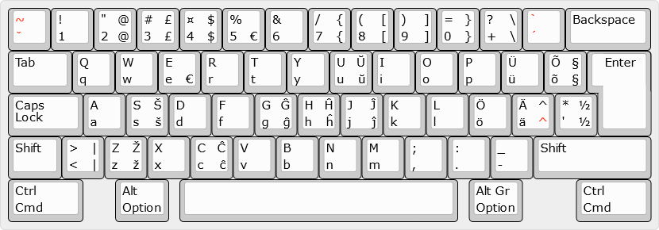

# Eesti, Esperanto
- Alumine vasak (nurk) - algselt
- Ülemine vasak - <kbd>Shift</kbd>
- Alumine parem - <kbd>Alt Gr</kbd> (or <kbd>Ctrl</kbd> + <kbd>Alt</kbd>)
- Ülemine parem - <kbd>Shift</kbd> + <kbd>Alt Gr</kbd>
- <span style="color: red">Punane</span> - sammuta klahv



<details>
  <summary>Allikas</summary>

  ```
  http://www.keyboard-layout-editor.com/##@_name=Eesti, Esperanto&css=* { %0A%20%20%20 font-family%2F: 'Verdana'%2F%3B%0A%20%20%20 font-size%2F: 15px%2F%3B%0A}%3B&@_t=%23ff0000%0A%23ff0000%3B&=~%0Aˇ&_t=%23000000%3B&=!%0A1&="%0A2%0A%2F@%0A%2F@&=%23%0A3%0A£%0A£&=¤%0A4%0A$%0A$&=%25%0A5%0A%0A€&=%2F&%0A6&=%2F%2F%0A7%0A{%0A{&=(%0A8%0A[%0A[&=)%0A9%0A]%0A]&=%2F=%0A0%0A}%0A}&=%3F%0A+%0A\%0A\&_t=%23ff0000%0A%23ff0000%3B&=`%0A´&_t=%23000000&w:2%3B&=Backspace%3B&@_w:1.5%3B&=Tab&=Q%0Aq&=W%0Aw&=E%0Ae%0A%0A€&=R%0Ar&=T%0At&=Y%0Ay&=U%0Au%0AŬ%0Aŭ&=I%0Ai&=O%0Ao&=P%0Ap&=Ü%0Aü&=Õ%0Aõ%0A§%0A§&_x:0.25&w:1.25&h:2&w2:1.5&h2:1&x2:-0.25%3B&=Enter%3B&@_w:1.75%3B&=Caps Lock&=A%0Aa&=S%0As%0AŠ%0Aš&=D%0Ad&=F%0Af&=G%0Ag%0AĜ%0Aĝ&=H%0Ah%0AĤ%0Aĥ&=J%0Aj%0AĴ%0Aĵ&=K%0Ak&=L%0Al&=Ö%0Aö&_t=%23000000%0A%0A%0A%23ff0000%3B&=Ä%0Aä%0A^%0A^&_t=%23000000%3B&=*%0A'%0A½%0A½%3B&@_w:1.25%3B&=Shift&=>%0A<%0A|%0A|&=Z%0Az%0AŽ%0Až&=X%0Ax&=C%0Ac%0AĈ%0Aĉ&=V%0Av&=B%0Ab&=N%0An&=M%0Am&=%2F%3B%0A,&=%2F:%0A.&=%2F_%0A-&_w:2.75%3B&=Shift%3B&@_w:1.75%3B&=Ctrl%0ACmd&_x:0.75&w:1.25%3B&=Alt%0AOption&_x:0.25&a:7&w:6.5%3B&=&_x:0.25&a:4&w:1.25%3B&=Alt Gr%0AOption&_x:1.25&w:1.75%3B&=Ctrl%0ACmd
  ```
</details>

## Sammuta klahvid
### <kbd>ˇ</kbd> (haak)
- <kbd>ˇ</kbd> = <kbd>ˇ</kbd>, (seejärel) <kbd>tühik</kbd>
- <kbd>č</kbd> = <kbd>ˇ</kbd>, <kbd>c</kbd>
- <kbd>š</kbd> = <kbd>ˇ</kbd>, <kbd>s</kbd>
- <kbd>ž</kbd> = <kbd>ˇ</kbd>, <kbd>z</kbd>

### <kbd>~</kbd> (tilde)
- <kbd>~</kbd> = <kbd>~</kbd>, (seejärel) <kbd>tühik</kbd>
- <kbd>õ</kbd> = <kbd>~</kbd>, <kbd>o</kbd>

### <kbd>´</kbd> (akuut)
- <kbd>´</kbd> = <kbd>´</kbd>, (seejärel) <kbd>tühik</kbd>
- <kbd>ć</kbd> = <kbd>´</kbd>, <kbd>c</kbd>
- <kbd>é</kbd> = <kbd>´</kbd>, <kbd>e</kbd>
- <kbd>ń</kbd> = <kbd>´</kbd>, <kbd>n</kbd>
- <kbd>ó</kbd> = <kbd>´</kbd>, <kbd>o</kbd>
- <kbd>ś</kbd> = <kbd>´</kbd>, <kbd>s</kbd>
- <kbd>ź</kbd> = <kbd>´</kbd>, <kbd>z</kbd>

### <kbd>`</kbd> (graavis)
- <kbd>\`</kbd> = <kbd>\`</kbd>, (seejärel) <kbd>tühik</kbd>
- <kbd>à</kbd> = <kbd>\`</kbd>, <kbd>a</kbd>
- <kbd>è</kbd> = <kbd>\`</kbd>, <kbd>e</kbd>
- <kbd>ò</kbd> = <kbd>\`</kbd>, <kbd>o</kbd>
- <kbd>ù</kbd> = <kbd>\`</kbd>, <kbd>u</kbd>

### <kbd>^</kbd> (tsirkumfleks)
- <kbd>^</kbd> = <kbd>^</kbd>, (seejärel) <kbd>tühik</kbd>
- <kbd>â</kbd> = <kbd>^</kbd>, <kbd>a</kbd>
- <kbd>ê</kbd> = <kbd>^</kbd>, <kbd>e</kbd>
- <kbd>ĝ</kbd> = <kbd>^</kbd>, <kbd>g</kbd>
- <kbd>î</kbd> = <kbd>^</kbd>, <kbd>i</kbd>
- <kbd>ŝ</kbd> = <kbd>^</kbd>, <kbd>s</kbd>
- <kbd>û</kbd> = <kbd>^</kbd>, <kbd>u</kbd>