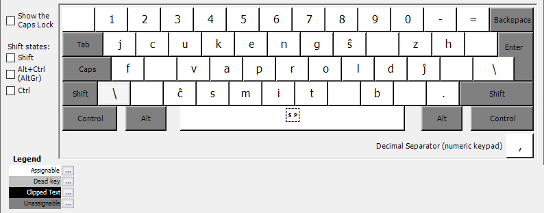
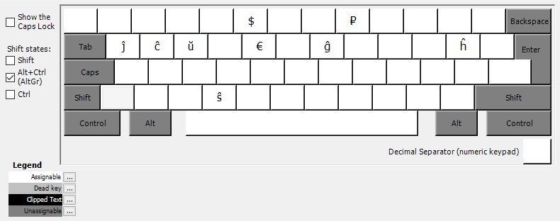
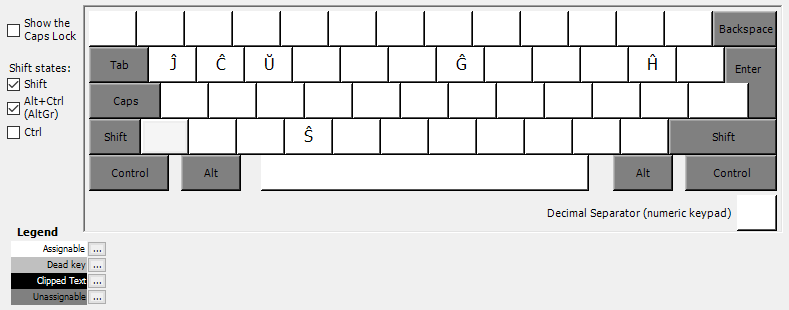

Русские буквы заменены буквами эсперанто, которые звучат или выглядят одинаково.
Приоритет отдаётся буквам, которые выглядят одинаково. Например `e` в эсперанто
звучит больше как русская `э`, а не `е`, но так как она выглядит
как русская `е`, обе буквы находятся на одной и той же кнопке.

Такая раскладка клавиатуры позволяет писать на эсперанто как на русском.

# По умолчанию

# Shift

# AltGr / Alt+Ctrl

# Shift+AltGr / Shift+Alt+Ctrl
