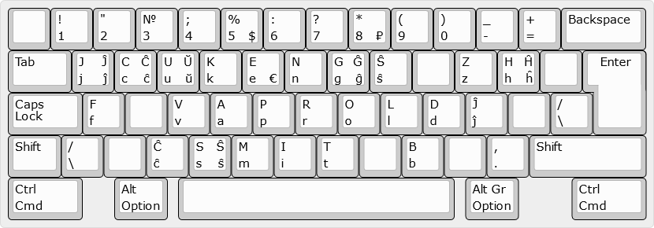

# Русский, Esperanto
Русские буквы заменены буквами эсперанто, которые звучат или выглядят одинаково.
Приоритет отдаётся буквам, которые выглядят одинаково. Например `e` в эсперанто
звучит больше как русская `э`, а не `е`, но так как она выглядит
как русская `е`, обе буквы находятся на одной и той же кнопке.

Такая раскладка клавиатуры позволяет писать на эсперанто как на русском.

- Нижний левый (угол) - по умолчанию
- Верхний левый - <kbd>Shift</kbd>
- Нижний правый - <kbd>Alt Gr</kbd> (or <kbd>Ctrl</kbd> + <kbd>Alt</kbd>)
- Верхний правый - <kbd>Shift</kbd> + <kbd>Alt Gr</kbd>



<details>
  <summary>Источник</summary>

  ```
  http://www.keyboard-layout-editor.com/##@_name=Русский, Esperanto&css=* { %0A%20%20%20 font-family%2F: 'Verdana'%2F%3B%0A%20%20%20 font-size%2F: 15px%2F%3B%0A}%3B&@_a:7%3B&=&_a:4%3B&=!%0A1&="%0A2&=№%0A3&=%2F%3B%0A4&=%25%0A5%0A%0A$&=%2F:%0A6&=%3F%0A7&=*%0A8%0A%0A₽&=(%0A9&=)%0A0&=%2F_%0A-&=+%0A%2F=&_w:2%3B&=Backspace%3B&@_w:1.5%3B&=Tab&=J%0Aj%0AĴ%0Aĵ&=C%0Ac%0AĈ%0Aĉ&=U%0Au%0AŬ%0Aŭ&=K%0Ak&=E%0Ae%0A%0A€&=N%0An&=G%0Ag%0AĜ%0Aĝ&=Ŝ%0Aŝ&_a:7%3B&=&_a:4%3B&=Z%0Az&=H%0Ah%0AĤ%0Aĥ&_a:7%3B&=&_x:0.25&a:4&w:1.25&h:2&w2:1.5&h2:1&x2:-0.25%3B&=Enter%3B&@_w:1.75%3B&=Caps Lock&=F%0Af&_a:7%3B&=&_a:4%3B&=V%0Av&=A%0Aa&=P%0Ap&=R%0Ar&=O%0Ao&=L%0Al&=D%0Ad&=Ĵ%0Aĵ&_a:7%3B&=&_a:4%3B&=%2F%2F%0A\%3B&@_w:1.25%3B&=Shift&=%2F%2F%0A\&_a:7%3B&=&_a:4%3B&=Ĉ%0Aĉ&=S%0As%0AŜ%0Aŝ&=M%0Am&=I%0Ai&=T%0At&_a:7%3B&=&_a:4%3B&=B%0Ab&_a:7%3B&=&_a:4%3B&=,%0A.&_w:2.75%3B&=Shift%3B&@_w:1.75%3B&=Ctrl%0ACmd&_x:0.75&w:1.25%3B&=Alt%0AOption&_x:0.25&a:7&w:6.5%3B&=&_x:0.25&a:4&w:1.25%3B&=Alt Gr%0AOption&_x:1.25&w:1.75%3B&=Ctrl%0ACmd
  ```
</details>